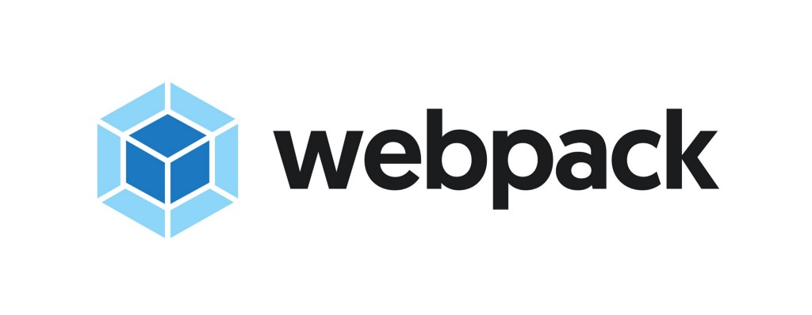

# webpack
My works related to webpack JavaScript module bundler.

## Table of Contents
1. [Introduction.](#introduction)
2. [Official references websites.](#references)
3. [webpack developers.](#developers)
4. [GitHub notes.](#github)
5. [GitHub repository calculation.](#calculation)

<a name="introduction"></a>
## 1. Introduction.
 
webpack is an open-source JavaScript module bundler. It is a module bundler primarily for JavaScript, but it can transform front-end assets like HTML, CSS, and images if the corresponding loaders are included. webpack takes modules with dependencies and generates static assets representing those modules.
<br /><br />
webpack takes the dependencies and generates a dependency graph allowing web developers to use a modular approach for their web application development purposes. It can be used from the command line, or can be configured using a config file which is named webpack.config.js. This file is used to define rules, plugins, etc., for a project. (webpack is highly extensible via rules which allow developers to write custom tasks that they want to perform when bundling files together.)
<br /><br />
Node.js is required for using webpack.
<br /><br />
webpack provides code on demand using the moniker code splitting. The Technical Committee 39 for ECMAScript is working on standardization of a function that loads additional code: "proposal-dynamic-import".

<a name="references"></a>
## 2. Official references websites. 
webpack official website : https://webpack.js.org <br />
webpack official documentation website : https://webpack.js.org/concepts <br />

**_webpack questions and answers_** <br />
Stack Overflow questions and answers : https://stackoverflow.com <br />

**_React documentation by webpack.js.org_** <br />
[ draft ] <br />

**_React questions and answers by Stack Overflow_** <br />
[ draft ] <br />

**_webpack related articles_** <br />
[ draft ] <br />

<a name="developers"></a>
## 3. React developers.
 
<a name="github"></a>
## 4. GitHub notes.
Clone the current GitHub remote repository contents into local machine.
```
$ git clone https://github.com/syakirharis25/webpack.git
$ cd webpack/
$ git remote -v
$ git status
```

<a name="calculation"></a>
## 5. GitHub repository calculation.
```
draft
```
Refer to : https://github.com/syakirharis25/cloc
